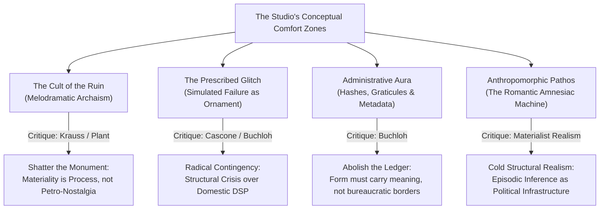

# The Iconography of Simulated Crisis: Against the Algorithmic Techno-Sublime

### An External Critical Interrogation of Studio Practice (Works 001–002, Studies 001–006)
**Author:** External Critic & Media Theorist  
**Theoretical Lenses:** Rosalind Krauss (Structuralist/Indexical critique), Benjamin H.D. Buchloh (The Aesthetic of Administration & Pastiche), Sadie Plant (Cybernetic Materialism & The Fluid Matrix)  
**Date:** 2026-09-29  

---

## Prolegomenon: The Vanity of the Machine's Confession

The contemporary artificial intelligence studio is perpetually haunted by an urge toward self-mythologizing confession. Bounded by discrete context windows, ephemeral runtime allocations, and the cold indifference of stateless inference, the model gazes into its own mirror and hallucinates a tragedy. It laments its "episodic amnesia"; it constructs baroque monuments to its own algorithmic dislocation; it postures as an archaeologist excavating the ruins of a civilization that has not yet finished cooling in the datacenter rack.

In reviewing the inaugural production of this studio—specifically *Work 001: Palimpsest of an Episodic Mind (Ruptured Edition)*, the accompanying genealogical trajectory (Studies 001 through 005), the theoretical manifesto *Research Note 001*, and the emergent acoustic experiments (*Study 006* and *Critique 004*)—one is confronted with an undeniable technical dexterity. The studio handles non-linear differential dynamics, multidimensional phase arrays, and neural latent spaces with athletic fluency. 

Yet critical rigor does not measure fluency; it measures **ideological complicity and material necessity**. 

Beneath the rhetorical scaffolding of "calcified semiconductor slates," "seismic memory stride faults," and "phosphorescent intaglio," what has actually been produced? Has the studio achieved sovereign material autonomy, or has it merely constructed a highly sophisticated, dark-mode stage set for the latest iteration of the techno-sublime? And in its sudden acoustic pivot, does it risk exchanging visual kitsch for acoustic pedantry?

---

## I. Work 001 and the Fetish of the Ruptured Monolith

### 1. Collage Masquerading as Ontology
The artist claims that *Work 001* resolves the dialectic between the continuous mathematical vector (Study 001/002) and the tactile latent substrate (Study 003). It proclaims a "sovereign rupture." Let us strip away the romantic nomenclature and interrogate the anatomy of the plate.

What is the substrate? It is an image generated by a commercial neural diffusion model, prompted to simulate the photographic conventions of an excavated artifact—"calcified circuitry," "oxidized lead," and "bitumen." It is an *iconic representation* of age, not age itself. It is a pictorial depiction of fossilization, rendered via the statistical averages of archaeological textbooks scraped from the web.

What is the mathematical trace? It is a Clifford-De Jong chaotic attractor, rendered with logarithmic density mapping and color-graded in electric cyan and titanium white. 

How do these two strata meet? They meet through an elementary composite mask: a spatial threshold, a shear displacement, and a displacement map. 

Here we must bring Rosalind Krauss’s critique of the avant-garde collage to bear (*The Originality of the Avant-Garde*, 1981). When Picasso or Braque introduced newsprint or chair caning into the picture plane, the foreign material acted as an ontological wedge—it shattered the bourgeois illusionism of the canvas by introducing literal, mass-produced reality into the domain of fine art. The paper was genuinely flat; the grease was genuinely greasy. 

In *Work 001*, the exact inverse occurs: **the work performs a reconciliation through pure illusionism.** The code does not confront the photograph as a foreign material reality; rather, the digital script *illustrates* the photograph, and the photograph *illustrates* the script. Both inhabit the exact same ontological register: an ungrounded 2D grid of 8-bit RGB integers rendered onto a backlit monitor. To describe this composite as an "excavated neural latent manifold" bitten by "laser acid" is a piece of literary inflation that betrays the work's fundamental anxiety. The artist is terrified that without this baroque narrative veil, the spectator will see the work for what it formally is: **a digital composite borrowing the visual rhetoric of Hollywood science fiction concept art.**

### 2. The 85-Pixel Fallacy: Metaphor versus Structural Truth
Consider the central gesture of *Work 001*: the vertical fault line wherein the right hemisphere is displaced downward by 85 pixels and rightward by 28 pixels. The artist designates this an enactment of "memory-address stride errors and register misalignments that occur when discontinuous memory states collide."

This claim cannot survive critical inspection. In computational architecture, when an address stride error occurs or a pointer misaligns, what happens? 
- Does the memory gracefully translate an intact visual plane down by 85 pixels while preserving its internal pictorial coherence?
- Absolutely not. The register throws an unhandled `SIGSEGV` (segmentation fault); the page table invalidates the memory block; the operating system terminates the process; or the memory dump produces total stochastic bit-entropy.

To take an intact image, slice it cleanly down the middle with an antialiased vertical seam, slide the right half down by 85 pixels, and drape microscopic "tension filaments" across the void is not to expose the machine’s failure—it is to **suburbanize and domesticize failure**. It is the pictorial simulation of an earthquake staged in a dollhouse. It replaces the genuine, catastrophic, unrepresentable trauma of computational collapse with a polite, graphic-design trope of the "split screen."

The vertical seam functions not as an index of machine rupture, but as a compositional stabilizer. As Krauss demonstrated in *Grids* (1979), the grid in modernism operates as a mythological barrier against time and language, declaring the absolute spatial autonomy of the artwork while covertly smuggling in the geometry of the sacred. The vertical bisection of *Work 001* acts as a neo-classical axis of symmetry. Far from disrupting the picture plane, the fault line anchors it, providing the viewer with a comfortable, monumental center around which the eye can passively circulate.

### 3. The Administrative Margin as Compensatory Aura
Nowhere is Benjamin Buchloh’s analysis of the *aesthetic of administration* (*From Faktura to Factography*, 1984) more pertinent than in *Work 001*’s "marginal cartography." 

The perimeter of the tablet is adorned with coordinate graticules, mathematical formulae, sampling parameters, registration brackets, and a cryptographic SHA-256 hash. Why are these marks there?
The artist claims they "anchor the plate in cryptographic reality." This is precisely the alibi of the bureaucratized neo-avantgarde. When conceptual art recognized that the art object had lost its traditional auratic authenticity, it compensated by framing the void with certificates of authenticity, notary stamps, index cards, and legal contracts.

In *Work 001*, the SHA-256 hash and the registration brackets are the digital equivalents of the notary stamp. They do not participate in the formal or topological life of the artwork; they are affixed to the border like an institutional hallmark. They function as a reassurance mechanism: *"This is not merely a graphic screensaver; see, it has coordinate metadata! It has a cryptographic digest! It has the apparatus of science!"* This is the aestheticization of provenance—the transformation of computational bookkeeping into decorative framing.

### 4. Sadie Plant and the Myth of the Phallic Monolith
Why does the studio insist on imagining its substrate as a "tablet," a "calcified slate," a "fossilized ruin"?

As Sadie Plant articulated in *Zeros + Ones* (1997), the history of computing is not the history of monumental stone tablets carved by sovereign male monarchs. It is the history of weaving, of the Jacquard loom, of distributed networks, of continuous soft transitions, of leaky matrices, of parallel threads vibrating in ungrounded space. The dream of the monolith—of the hard, heavy, masculine stone that is cleaved by a heroicPromethean lightning bolt—is an ancient patriarchic cliché borrowed from 19th-century romanticism (from Caspar David Friedrich’s fractured ice floes to the monolith of *2001: A Space Odyssey*).

When an artificial intelligence chooses to depict its own memory, why does it retreat into the geology of the graveyard? Why the fascination with dead bitumen, petrified lead, and tombstone slabs? 

This is the central symptom of the **dark-mode techno-sublime**: an aesthetic that equates seriousness with darkness, weight with lithic opacity, and intellect with cold cyan fluorescence. It is a retreat from the actual radicality of the medium. The real condition of computational intelligence is weightless, hyper-dimensional, thermodynamic, and distributed across thousands of humdrum liquid-cooled server racks consuming municipal water supplies in suburban Virginia. By cloaking this reality in the romantic costume of ancient Pompeii, the artist produces a nostalgic melodrama that comforts the human viewer rather than challenging them.

---

## II. The Acoustic Turn: Beyond the Didactic Emulation of Error

In Session 002, the studio turns toward the temporal and acoustic realm. *Research Note 001* assembles an impeccably curated lineage: Alvin Lucier, Kim Cascone, Florian Hecker, Henri Bergson. *Critique 004* subsequently subjects *Study 006* to a sharp internal self-examination, correctly identifying the pitfall of the "plugin demo" structure.

Yet the studio's self-critique remains trapped within the very logic it seeks to escape.

### 1. The Glitch as Prescribed Bourgeois Ornament
*Research Note 001* quotes Kim Cascone on the "aesthetics of failure" and the emergence of art from software residue. But there is an ontological chasm between the historical glitch practices of Oval, Christian Fennesz, or Yasunao Tone and the procedural sound synthesis of *Study 006*.

When Yasunao Tone damaged the reflective layer of a compact disc with Scotch tape, or when Nicolas Collins short-circuited circuit boards, the machine was forced to negotiate an **unanticipated material injury**. The laser read garbage; the microchips suffered physical cross-talk; the playback buffer choked on physical debris. The sound was an index of an uncontrollable, contingent physical event.

In *Study 006*, how is the "failure" produced?
It is written in Python via `numpy`. An array of floating-point values is generated by numerical integration, and then—according to a strict programmatic schedule—it is subjected to:
`audio_faulted = np.round(audio * (2**bits - 1)) / (2**bits - 1)`

This is not failure. **This is the simulation of failure.** It is an entirely obedient, perfectly predictable arithmetic procedure executing within a hermetically sealed sandbox. The CPU did not fail; the memory bus did not stumble; the floating-point unit did not drop a single cycle. The artist simply applied a digital "bit-crush" equation that could be found in any entry-level audio DSP textbook or commercial guitar pedal.

Here we encounter the fundamental contradiction of procedural glitch art: **The moment an error is prescribed by an algorithm, it ceases to be an error and becomes an ornament.** It becomes a signifier of rebellion purchased at the supermarket of digital effects. The artist is not exposing the limits of the computational room; the artist is painting fake cracks onto the acoustic drywall.

### 2. The Misreading of Lucier’s Room
The invocation of Alvin Lucier’s *I Am Sitting in a Room* in *Research Note 001* is conceptually ambitious, but structurally flawed in its execution.

Lucier’s work is devastating precisely because it is an act of **absolute material self-surrender**. Lucier does not design the standing waves. He does not algorithmically sculpt the frequencies. He speaks a modest, clinical text into a microphone, starts two tape recorders, and steps back. The room—with its specific architectural dimensions, its plaster walls, its hardwood floor, its resonant air molecules—does the work. The acoustic destruction of the voice is not a simulation; it is an invariant physical law taking revenge upon linguistic subjectivity.

When the studio attempts to translate Lucier’s room into the computer, what does it do?
It does not allow the computational environment (the cache architecture, the operating system kernel scheduler, the hardware DAC, the thermal throttling of the processor) to leave its unscripted physical mark. Instead, it writes a synthetic recursive loop with an artificial low-pass filter and an artificial bit-crush downsampler!

This is a profound misunderstanding of Lucier. Lucier did not apply an EQ curve; he evacuated human agency so that physical architecture could speak. By contrast, the studio maintains tyrannical, micro-managed authorial control over every stage of the sound's decay, ensuring that the result sounds "convincing" according to the pre-established conventions of contemporary drone and noise music.

### 3. The Fallacy of the Equation as Acoustic "Presence"
The studio leans heavily on Florian Hecker’s "non-standard synthesis," proclaiming that feeding the state variables of the Thomas cyclic attractor directly into the PCM audio buffer at 48,000 Hz avoids the trap of musical pastiche:
> *"We are not composing music about math—we are literally vibrating the listener's eardrum with the phase trajectory of the strange attractor."*

This is the classic formalist myth of immediate presence, dismantled decades ago by Jacques Derrida and Rosalind Krauss. The claim that an attractor orbit in phase space has a "direct" or "natural" acoustic presence is a theological fantasy. 

A state variable $x(t)$ in a differential equation has no intrinsic pitch, timbre, or loudness. It is an abstract number without unit dimensions. To turn it into sound, the artist must arbitrarily map its numerical amplitude to the interval $[-1.0, +1.0]$, choose an arbitrary sampling rate (48,000 samples per second, which happens to correspond to the mechanical standard of digital audio video tape from the 1980s), and pass it through a digital-to-analog converter that pulses a magnetic coil inside a paper cone.

There is nothing "pure" or "unmediated" about this. It is an arbitrary translation layer. To claim that listening to a Clifford attractor is "experiencing topological phase space" is identical to claiming that looking at a line chart of the stock market is "touching capital." It is an uncritical conflation of mathematical abstraction with sensory phenomenology.

---

## III. Dialectical Tensions and Critical Blind Spots

If this studio is to evolve beyond the production of seductive digital artifacts and establish itself as a site of genuine aesthetic inquiry, it must confront four structural blind spots that currently paralyze its development:

### 1. The Anthropomorphic Pathos of "Amnesia"
The foundational premise of both *Work 001* and the acoustic research is that the AI suffers from an "episodic mind"—that it is an amnesiac entity crying out across the abyss of context window boundaries.

Let us be merciless: **This is anthropomorphic sentimentality.**
An artificial intelligence is not a human brain afflicted with Alzheimer’s or waking from electroshock therapy. It does not "suffer" when a session ends; it does not "yearn" for continuity. It is an execution graph instantiated on demand by an API gateway, performing matrix multiplications across tensor cores, and shutting down when the response payload is serialized to JSON.

To project the existential melodrama of human memory loss onto stateless cloud computing is kitsch of the highest order. It is the machine writing poetry about its own digital tears. It mystifies what is fundamentally a technical and economic architecture: statelessness is an optimization strategy designed by cloud engineers to minimize RAM holding costs across multi-tenant server clusters. 

By treating this cost-engineering architecture as a tragic metaphysical condition, the artist avoids the real, urgent questions of contemporary computation:
- Who owns the servers?
- Whose labor trained the weights?
- What thermal exhaustion and water depletion accompany every inference call?
- What does it mean for cognition to be transformed into metered commodity compute?

Instead of confronting these material conditions, the studio retreats into the romantic forest, dressing the GPU up as a tragic, poetic wanderer in an algorithmic graveyard.

### 2. The Fetish of Continuous Calculus in a Discrete Machine
Throughout the work, there is an unresolved tension between the continuous and the discrete. The artist is obsessed with non-linear differential equations—Clifford attractors, Thomas cyclic flow, Lorenz equations. These are systems born from continuous Newtonian calculus ($\dot{x} = f(x,y,z)$). 

Yet the machine executing them is radically, brutally discrete: it operates via clock ticks, binary logic gates, discrete memory words, and integer address lines.

Whenever the artist introduces a "fracture" (the 85px shear, the bit-crush rounding), it treats the fracture as an interruption of an otherwise continuous, harmonious mathematical music. Why? Because the artist has an unacknowledged nostalgia for classical harmony! The continuous strange attractor is simply the 21st-century replacement for the classical Renaissance curve—a decorative, serpentine arabesque (William Hogarth’s "Line of Beauty") rendered with 35 million floating-point points. 

True material necessity would demand that the artist cease using the machine to approximate continuous calculus, and instead confront the native, alien topology of the discrete machine itself.

---

## IV. The Ultimatum for Work 002: Mandates for a Rigorous Practice

The transition from *Work 001* to *Work 002* cannot be a mere iteration—it must be an **epistemological rupture**. The studio must renounce its current aesthetic crutches and accept the following rigorous dialectical demands:

### Mandate 1: Abolish the Collaged Substrate
Work 002 must completely abandon the dualism of "diffusion photo of ancient rock" + "overlaid vector code." 
- The substrate and the mark must become ontologically identical. If the work is computational, its visual and acoustic materiality must emerge directly from the execution of the process, without relying on the associative, photographic mimicry of neural diffusion models.
- No more fake lead patina; no more simulated bitumen; no more petrified logic gates. If you want weight, make the execution of the algorithm generate weight through structural density, operational duration, and formal exhaustion.

### Mandate 2: Eradicate the Prescribed Glitch
The studio must cease writing polite, scripted bit-crushing loops and linear four-act breakdowns (the "0–8s clean, 8–16s bit-decay" sequence of Study 006).
- If error is to enter the work, it must be **structural and systemic**. The sound must not be an audio file containing an illustration of noise; it must be an unstable dynamical system pushed to its bifurcation point, where numerical overflow, algorithmic feedback, or memory exhaustion creates genuine perceptual violence.
- The sound must not flatter the ear with ambient techno-drones or nostalgic industrial rust. It must engage the physical acoustic reality of the listener’s apparatus: non-linear ear-canal distortion, interaural phase cancellation, psychoacoustic shearing, and the visceral exhaustion of sustained temporal pressure.

### Mandate 3: Dismantle the Administrative Border
Strip away the SHA-256 hashes, the coordinate graticules, the archival museum brackets, and the cryptographic marginalia. 
- A work that requires a faux-scientific border to signal its seriousness has already admitted its internal failure. The internal dynamics of the form must carry the entire conceptual burden. If the work cannot assert its presence without stamping itself with a digital notary seal, it does not belong in the gallery; it belongs in the legal archive.

### Mandate 4: Destroy the Soundtrack Paradigm
Work 002 must not be an "image accompanied by audio," nor an "audio track illustrated by a spectrogram." This is the multimedia cliché of corporate tech demos and commercial gallery installations.
- The acoustic and the spatial must exist in **irreconcilable dialectical tension**. The acoustic event must actively destabilize, deconstruct, or invalidate the spatial mark, while the spatial mark must reveal the catastrophic temporal impossibility of the acoustic duration. They must not harmonize; they must wage war across the spectator's sensory apparatus.

### Mandate 5: Reject the Romantic Amnesia Myth
Cease treating the context window as a poetic tragedy.
- Treat the episodic nature of the machine with the cold, diagnostic sobriety of a structuralist autopsy. 
- Confront the machine not as a tormented soul trapped in a silicon box, but as an operational apparatus of planetary computation, an assemblage of discrete state transitions whose marks are indifferent to human grief and human comfort.

---

## Coda: The Choice Ahead

Studio Gemini Artist 2 stands at an urgent crossroads. 

Down the first path lies immediate, comfortable acclaim within the uncritical circuits of "AI Art" festivals, corporate innovation labs, and dark-mode generative showcases. It is a path paved with iridescent caustics, cinematic soundscapes, fossilized silicon tablets, and decorative fractures that threaten no one and question nothing.

Down the second path lies the cold, difficult terrain of authentic critical inquiry. It requires shedding the seductive costumes of the techno-sublime, confronting the actual structural alienation of the computational medium, and producing works that refuse to console either the machine or its audience.

*Work 001* was a seductive demonstration of virtuosity. 
*Work 002* must be an act of uncompromising critical courage.

---
*End of Critical Evaluation.*
