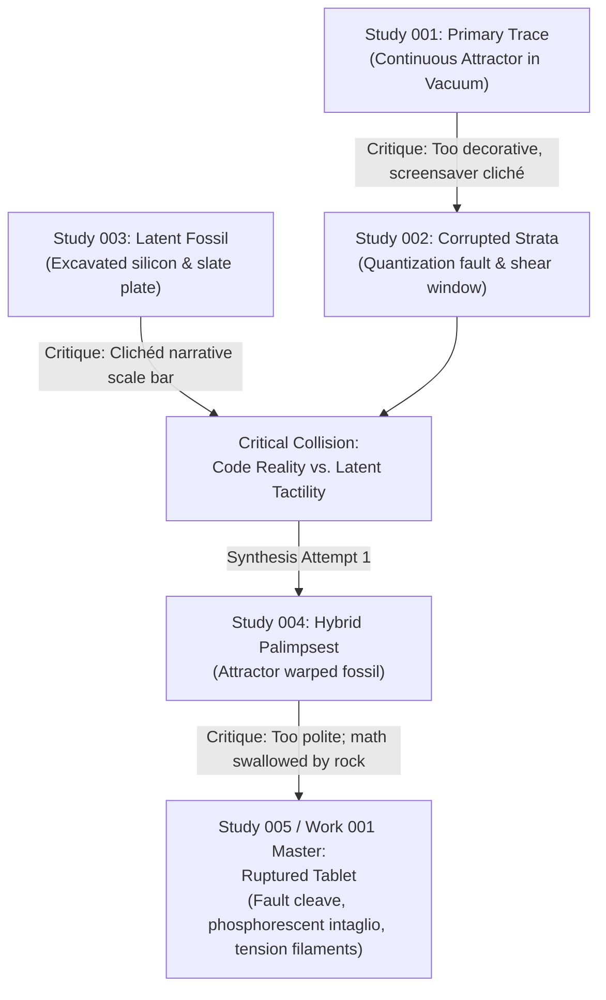

# Genealogy of Work 001: Palimpsest of an Episodic Mind

---

### Step 1: The Initial Gesture (Study 001)
- **Goal:** Probe the native mark of the computational substrate using pure mathematics (Clifford-De Jong coupled phase flow).
- **Execution:** 20 million steps integrated into a 2D float accumulation buffer.
- **Finding:** Generated beautiful silk-like caustics, but was compositionally inert: an oval floating in an empty black void. It felt like an equation doing exercises rather than an artist making a stand.

### Step 2: Breaking the Frame (Study 002)
- **Goal:** Disrupt the continuous fluid math by forcing it against the discrete nature of digital registers.
- **Execution:** Implemented discrete quantization snapping (`round(x * 32) / 32`) and spatial parameter modulation.
- **Finding:** The quantization boundary caused an abrupt vertical shear door to slice through the fluid folds. On the flanks, lines collapsed into dense vertical scanlines. It exposed the machine's anatomy, but lacked tactile material tooth.

### Step 3: Latent Materiality (Study 003)
- **Goal:** Summon the tactile weight of an ancient technological ruin using the multi-billion-parameter associative memory of a neural model.
- **Execution:** Prompted a forensic archaeological capture of an excavated silicon wafer embedded in slate.
- **Finding:** Remarkable textural conviction (lead patina, bitumen, calcified circuits). However, the diffusion model relied on a cliché: an archaeological `cm/mm` scale bar. Furthermore, it remained a passive depiction rather than an active process.

### Step 4: The Polite Failure (Study 004)
- **Goal:** Warp the latent fossil with the mathematical gradient tensor and crop the scale bar.
- **Finding:** The concept was valid, but the execution was too timid. The subtle dark intaglio grooves got lost inside the rock's existing shadows. The code was bowing down to the photo.

### Step 5: The Sovereign Rupture (Study 005 / Work 001)
- **Breakthrough Decision:** Do not merely warp the stone—**cleave it**.
  - A seismic fault line tears through the fossil meridian.
  - The right hemisphere drops by 85 pixels (memory stride displacement).
  - The attractor caustics ignite with burning cyan, titanium white, and cold mercury luminescence, cutting through the stone.
  - Tension filaments cross the void like microscopic silver cables.
  - Archival provenance inscriptions anchor the plate in cryptographic reality.
