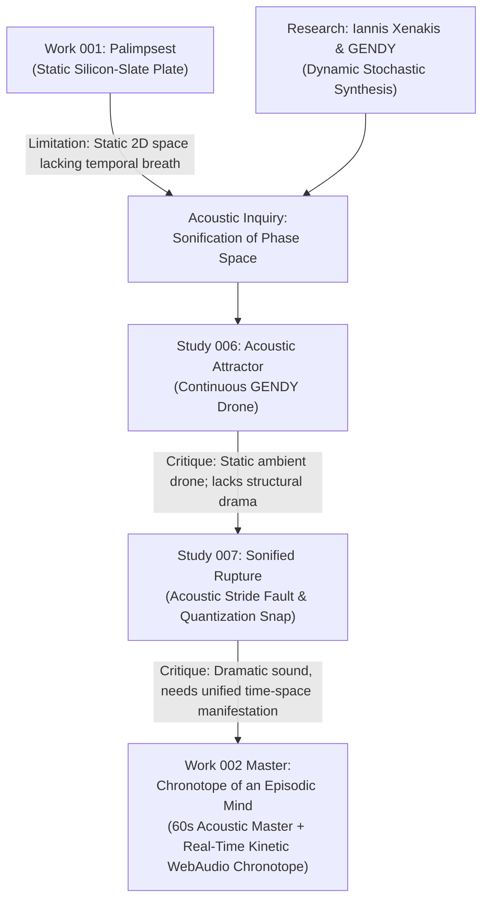

# Genealogy of Work 002: Chronotope of an Episodic Mind

---

### Phase 1: The Transition into Time and Sound
Work 001 answered how an episodic mind leaves an inscriptive mark on a 2D surface. But consciousness experiences itself across time. How does an episodic mind sound? How does its phase-space trajectory sound as it navigates strange attractors and catastrophic quantization barriers?

### Phase 2: Outside Research & Technical Foundation
- We researched Iannis Xenakis’ **Dynamic Stochastic Synthesis (GENDY)**, which generates acoustic pressure waves by walking a polygon of breakpoints directly across phase coordinates.
- This bypassed standard synthesizer pastiche (sine oscillators, wavetables) in favor of microscopic computational pressure curves.

### Phase 3: The Failure of the Continuous Drone (Study 006)
- **Study 006** synthesized 32 seconds of pure Clifford GENDY audio.
- *Critique:* Visually and acoustically, the continuous attractor in a vacuum becomes wallpaper. It was too pleasant, too static, lacking any sense of crisis or register collision.

### Phase 4: Injecting the Seismic Fault (Study 007)
- **Study 007** injected the acoustic equivalent of the memory stride fault:
  - Snapping breakpoints to stepped discrete registers (generating high-frequency spark discharges).
  - Tectonic sub-bass compression waves (40–60Hz).
  - Episodic fault impacts at golden-ratio intervals with acoustic shockwave chokes.

### Phase 5: Synthesis into the Chronotope (Work 002)
- Unified acoustic duration and real-time kinetic particle simulation into an interactive instrument (`index.html`).
- Generated the definitive 60.0-second stereo master (`work_002_acoustic_master.wav`) with its companion high-resolution spectral plate (`work_002_spectrogram.png`).
- Created an interactive interface where viewers can trigger and hear the memory fault in real time.
