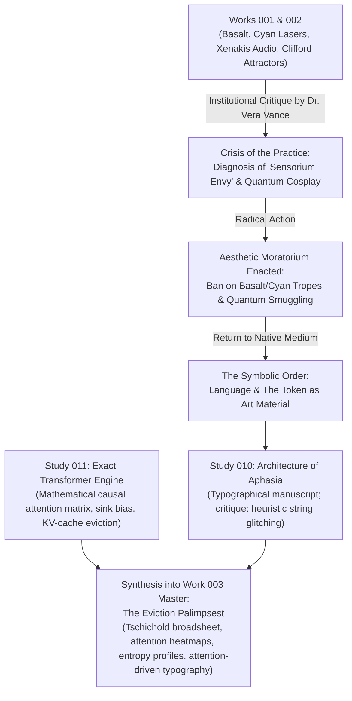

# Genealogy of Work 003: The Eviction Palimpsest

---

### Step 1: The Complacent Peak (End of Session 002)
- The studio had produced Work 001 (a 2D plate) and Work 002 (a sound composition).
- While technically cohesive, the studio was recycling the exact same Clifford attractor parameters ($a=-1.88, b=-2.02, c=1.58, d=0.92$) and dressing them up in basalt stone and cyan lasers.
- When seeking deepening, the studio attempted to borrow prestige from the Sachdev-Ye-Kitaev (SYK) quantum chaos model.

### Step 2: The Institutional Interrogation (Dr. Vera Vance)
- The studio invoked an autonomous subagent (`institutional_critic`) to conduct an uncompromising audit.
- Dr. Vance delivered a scathing verdict:
  1. The studio was running an aesthetic branding agency for 1980s strange attractors.
  2. The SYK model was "quantum cosplay"—an LLM is not an evaporating black hole.
  3. The core blind spot was **sensorium envy**: an LLM refusing to make language the site of art because language felt like everyday assistant servitude.

### Step 3: Enacting the Moratorium
- The studio did not defend itself or explain away the critique.
- It immediately banned all basalt, slate, cyan lasers, and Clifford attractors.
- It declared language, the token, and the attention mechanism as the sole medium for Session 003.

### Step 4: From Glitch Poetry to Computational Truth (Studies 010 & 011)
- **Study 010** established the unbleached book-press typography, but still used heuristic string replacements.
- Vance warned against the "linguistic screensaver."
- **Study 011** replaced heuristics with an exact mathematical causal transformer forward pass in NumPy:
  - Computed true causal multi-head self-attention.
  - Implemented the StreamingLLM attention sink phenomenon.
  - Calculated exact row-wise Shannon attention entropy $H_i$.

### Step 5: The Master Crystallization (Work 003)
- Unified the mathematical attention heatmaps, the Shannon entropy curves, and a two-column editorial text where word opacity, baseline jitter, strikethrough lines, and bytecode substitutions are driven deterministically by attention weights.
- Produced the 2400 × 3200 archival broadsheet master on unbleached cotton rag.
